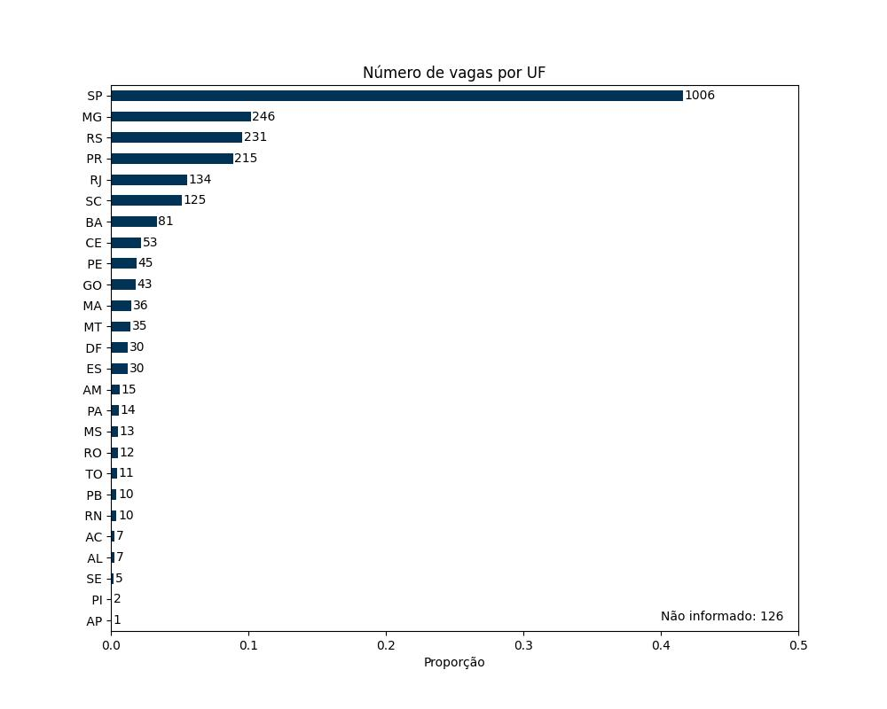
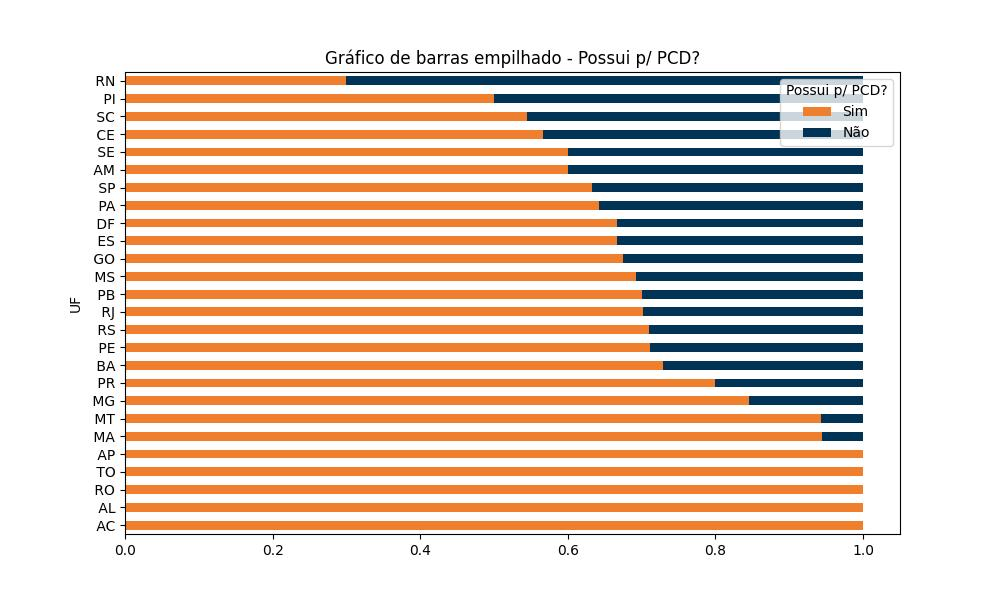
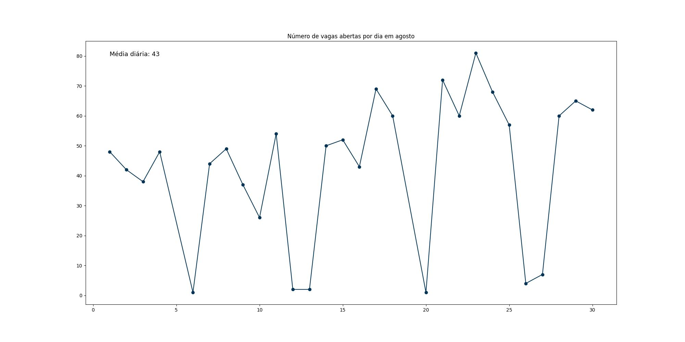
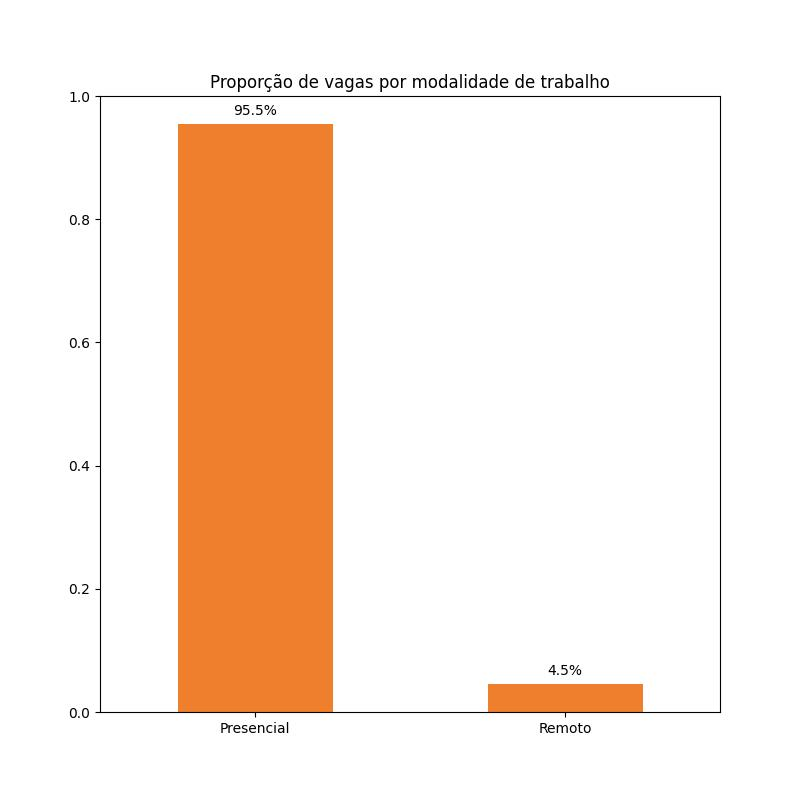
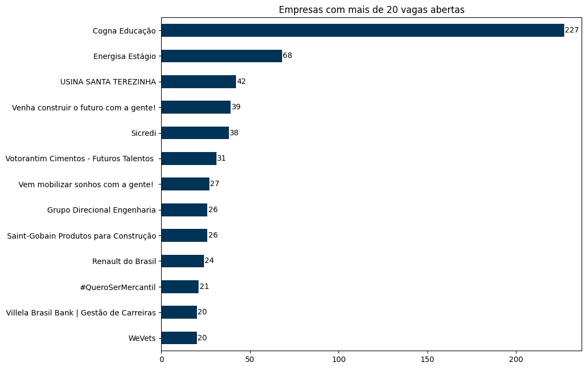

# Web scraping *gupy*
## Sobre
Esse é um projeto de extração e análise de dados de vagas de emprego na plataforma [Gupy](https://portal.gupy.io), com Python.                                                                                              
Tecnologias utilizadas: `Python, BeautifulSoup, selenium, pandas, matplotlib, numpy, time, requests`.

Como o objetivo é extrair o máximo de dados de vagas possível, tentei encontrar as palavras chaves que mais obtessem resultados. 
O termo `estágio` obteve um número considerável de respostas, com mais de 2500 vagas.

## Metodologia
Esse código consite em utilizar `selenium` para abrir a plataforma Gupy em um driver Chrome, pesquisar "estágio", *scrollar* até a última vaga 
disponível, salvar o conteúdo do *html* com `BeautifulSoup` e exportar dados tabulares com `pandas`. 

-> **[/main/main.py](https://github.com/marcoaguibor/web-scraping-gupy/blob/main/main/main.py):** apresenta essa metodologia, desde a importação dos  módulos utilizados, extrair e salvar os dados em uma lista de listas e transformá-los em um dataframe .csv;   
-> **[/data/data.csv](https://github.com/marcoaguibor/web-scraping-gupy/blob/main/data/data.csv):** são os dados já salvos, com 11 colunas (variáveis) e mais de 2500 linhas (vagas abertas);     
-> **[/plot](https://github.com/marcoaguibor/web-scraping-gupy/tree/main/plot):** contém os arquivos .jpeg dos gráficos criados;

-> **[data_analysis.ipynib](https://github.com/marcoaguibor/web-scraping-gupy/blob/main/data_analysis.ipynb):** apresenta os resultados, com os códigos para os gráficos e interpretações.   

O termo **estágio** foi escolhido por retornar um número de vagas (+-2500) que possa ser coletado por webscrapping em um período de tempo não tão longo, e que possibilite realizar análises e obter insights úteis.

## Alguns resultados  
### Para análise completa, acesse: **[data_analysis.ipynib](https://github.com/marcoaguibor/web-scraping-gupy/blob/main/data_analysis.ipynb)**  
Data do *scraping*: 30 de agosto de 2023 | Pesquisa: "estágio"

* Dividindo os dados por unidade federativa, obtemos alguns resultados: São Paulo possui o maior número de vagas, seguido por Minas Gerais, Rio Grande do Sul e Paraná. Alguns estados encontram-se com pouquíssimas vagas disponíveis, como Amapá e Piauí.

  

* Entre as vagas encontradas, 780 (30,7%) não especificaram se possuem vagas para pessoas com deficiência.   Entre as vagas remotas, foram 38 vagas (33%) sem especificação e entre as presenciais, 742 vagas (31%).
     
  O gráfico abaixo apresenta a proporção de vagas para pessoas com deficiência, por estado.

  

* Em agosto, alguns dias tiveram mais de 70 publicações de vagas e outros zero. O gráfico abaixo apresenta o número de vagas publicadas por dia. Note que os dias que tem poucas ou zero vagas são finais de semana. Além disso, o número médio de vagas publicadas por dia é aproximadamente 43.

  

* Em relação a modalidade, 95,5% das vagas são presenciais. Essa alta percentagem se deve a vagas híbridas que colocam em suas descrições que são presenciais, com finalidade de atrair majoritariamente candidatos que morem na cidade da vaga.

 

  

* As seguintes empresas possuem número maior ou igual a 20 vagas abertas. "Cogna Educação" ficou a frente, com mais de 220 vagas em aberto.
  

  

## Informações adicionais
O webscraping é uma técnica de extração de dados que apresenta benefícios e limitações. Para a análise proposta, o tema "estágio" foi escolhido por retornar um número suficiente de vagas, possibilidando extrair informações a partir dos dados. No entanto, para expandir ainda mais a coleta, é uma boa ideia utilizar a [API do Gupy](https://developers.gupy.io/). Uma API pode fornecer dados já estruturados, como JSON ou XLM ao invés do HTML, objeto de coleta e extração do scraping.
